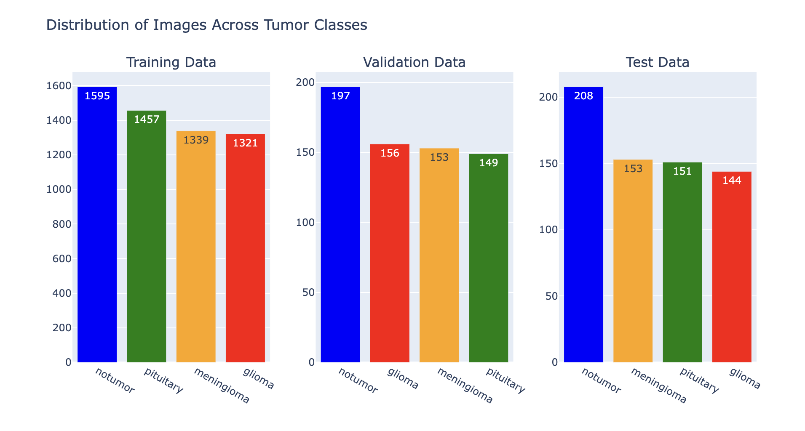
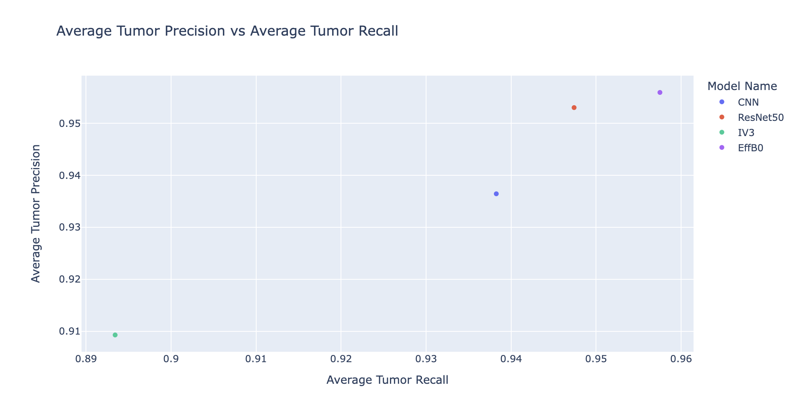

# BrainTumorDetectionCNN
### Detecting Gliomas, Meningiomas, and Pituitary Brain Tumors Using Convolutional Neural Networks
Access the full notebook [here](https://nbviewer.org/github/anushkarao5/BrainTumorDetectionCNN/blob/main/BrainTumorDetection.ipynb) for all code and in-depth explanations. 

## Table of Contents
- [Project Objectives](#project-objective)
- [Project Outcomes](#project-outcomes)
- [Background Information](#background-information)
- [Understanding the Data](#understanding-the-data)
- [Evaluation Metrics](#evaluation-metrics)
- [Model Types](#model-types)
- [Model Performance](#model-performance)
- [Conclusions](#conclusions)
  
## Project Objectives
The objectives of this project are to:
- Develop a convolutional neural network specialized in detecting gliomas, meningiomas, and pituitary brain tumors
- Utilize pre-trained models to increase recall in tumor classes

## Project Outcomes 
- Developed a simple CNN with a minimum of 86.5% recall in all tumor classes and an average recall of 93.8% in the tumor classes
- Applied transfer learning to EfficientNetB0 model to achieve over 95% recall in all tumor classes and 95.7% average recall in the tumor classes

## Background Information
Advancements in medical image classification hold the potential to streamline the tumor detection process. While not unerring, technology-based classification offers a preliminary categorization of tumors, facilitating quicker decision-making for professionals.

  

  <a href="https://awaregleneaglesglobalhospitallbnagar.com/health-plus-blog/what-are-the-common-sign-and-symptoms-of-a-brain-tumour/">Image Credits</a>

The three tumor types we will focus on detecting are gliomas, meningiomas, and pituitary tumors. 

**Gliomas**

- Gliomas are tumors that arise from glial cells, which are supportive cells in the brain. Symptoms of gliomas vary depending on the location and size of the tumor. Treatment options include surgery, radiation therapy, and chemotherapy.

**Meningiomas**

- Meningiomas are tumors that originate in the meninges, the layer of tissue covering the brain and spinal cord. These tumors are usually benign and slow-growing, but they can cause issues if they grow or press on nearby structures.
  
**Pituitary Tumors**

- Pituitary tumors are growths that develop in the pituitary gland, a small gland at the base of the brain that regulates hormone production. Symptoms of pituitary tumors can include hormonal imbalances, changes in growth, and visual disturbances.

## Understanding the Data
- This data was taken from [Kaggle’s Brain Tumor MRI Dataset](https://www.kaggle.com/datasets/masoudnickparvar/brain-tumor-mri-dataset?rvi=1). 
- The dataset consists of a preassigned training and testing set. 
  - There are 5712 images in the training set and 1311 images in the test set. 
- I further split the test set into a testing set and a validation set.
  
Here is the distribution of images per class:

  

As we can see, there are significantly more no-tumor cases than tumor cases, especially in the validation and testing sets. Since the models have more instances of no tumor cases to learn from, we expect the models to perform best in detecting no tumor cases. Conversely, the distribution of images among the various tumor classes is comparable, so we expect the models to demonstrate similar performance in detecting tumor cases across these classes.

## Evaluation Metrics 
We will evaluate the performance of our model using accuracy, precision, and recall. **In our problem domain, we favor a classifier with high recall in the tumor classes.** Why is this? Missing a true positive (a tumor case) carries more significant consequences than misclassifying a non-tumor case as a tumor case. Prioritizing high recall in the tumor classes allows us to capture as many true tumor cases as possible. While this approach may reduce precision in the tumor classes– the classifier may assign non-tumor cases to tumor classes more liberally–, it minimizes the risk of overlooking true tumor cases.

## Model Types
We will explore 4 CNN types.
1) A basic three-layered CNN with global max pooling
2) Pretrained ResNet50
3) Pretrained InceptionNet
4) Pretrained EfficientNet

Click [here](https://docs.google.com/document/d/1rzPfFhG4TEHhzyGpa0jx905BPoGSowLiE98WUArPvhM/edit?usp=sharing) to learn more about the basic CNN model for classification (conv2D layers, pooling, dense layers, and softmax activiation).

Click [here](https://docs.google.com/document/d/1tONf-wTolvjdriQJEn178vQQC4XlJ6PoGlZtUC6LbvA/edit?usp=sharing) to learn more about the pre-trained models.

## Model Performance
To evaluate model performance, let us see how well each classifier is able to recognize each type of tumor. 

**Gliomas**

  

- Our simple CNN has the highest recall (96.5%) with EffB0 following shortly after (95.1%). While the CNN has around 1.5% higher recall, it has 5% lower precision than the EffB0 model. 
- ResNet50 has 87.5% recall. While this number may seem high, we must consider it in terms of our problem domain: For every 100 patients with gliomas, 12.5 percent are not detected. That is a costly mistake!
- Inception Net is by far our poorest classifier, with a recall of less than 80%. 
- Ranked from best to worst: CNN, EffB0, ResNet50, IV3

**Meningiomas**

  

- ResNet50 has the highest recall of 97.4%. 
- EffB0 and IV3 perform relatively well in comparison, with recalls of 95.4% and 93.5% respectively.
- CNNS performed worse, with a recall of 86.3%. 
- Ranked from best to worst: ResNet50, EffB0, IV3, CNN. 

**Pituitary Tumors**

  

- ResNet50 performed the best with a recall of 99.3%. The simple CNN followed shortly after with a recall of 98.6% and 2.5% greater precision than ResNet. 
- EffB0 has a recall of 96.7% and perfect precision. IV3 followed shortly after with both the lowest recall and precision of all the classifiers (94.7% and 94.1% respectively). 
- Note that all three classifiers have the best recall in this class. 
- Ranked from best to worst: ResNet50, CNN, EffB0, and IV3

## Conclusions

Based on the above observations, we know that different models have different strengths in which tumors they are best able to classify. To get a more singular measurement, let us average the recall and precision of all three tumor types for each model. 

  

- Our best classifier based on average tumor recall is the efficient net model (95.7% average recall and 95.6% average precision.
- ResNet is a close second, with an average recall of 94.7% and an average precision of 95.3%. 
- Our three-level CNN fell in ranks with an average tumor recall of 93.8% and an average tumor precision of 93.6%. 
- The IV3 model performed worse both in terms of recall and precision. Average recall was just short of 90% and average precision was 90.1%. 

**So which classifier is the best?**
- It's probably easier to determine which classifier is not the best-- Inception V3. This classifier has a significantly lower average tumor recall due to the low recall in the glioma class. The other classifiers are a bit more difficult to determine. The best classifiers depend on which disease we are trying to detect!
- CNNS and EffB0s are best for glioma, ResNet50 is the best for meningiomas, and ResNets and CNNs are the best for pituitary.
- *So our choice of which classifier depends on the type of tumor we are screening for.*
- However, if we want a certain answer, based on the macro tumor recall, EffB0 is the best classifier.
- Here we have found classifiers that are able to detect the tumor class for each with a minimum of 95% recall. Not too bad!

